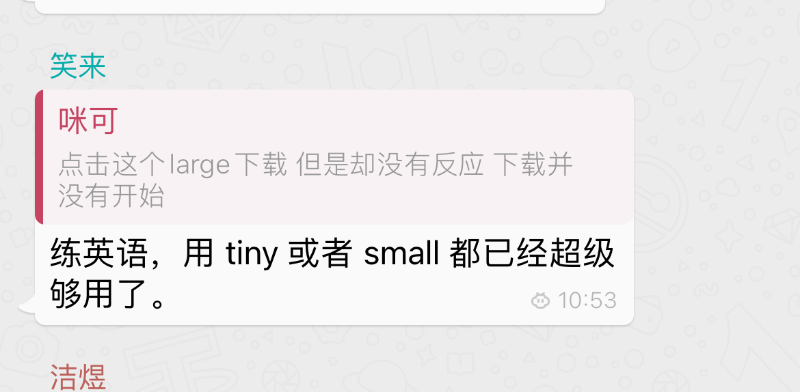

经常看到很多社群的同学，总想下载大的模型,模型越大准确率越高，这么说没错，但也错了，在处理语音转英文这个事情上，或者说生成英文，这个任务是基本公无论哪个模型都擅长干这个事情。其实最小的模型就可以了。

甚至是笑来老师亲自回答了这个文问题：

下面是whisper对设备的要求：

| 模型              | 模型占用磁盘空间           | 模型运行需要的显存大小  |
|:----------------:|:------------------------:|:----------------------:|
| tiny             | 75 MB (ggml-tiny.bin)     | ~390 MB                |
| tiny.en          | 75 MB (ggml-tiny.en.bin)  | ~390 MB                |
| base             | 142 MB (ggml-base.bin)    | ~500 MB                |
| base.en          | 142 MB (ggml-base.en.bin) | ~500 MB                |
| small            | 466 MB (ggml-small.bin)   | ~1.0 GB                |
| small.en         | 466 MB (ggml-small.en.bin)| ~1.0 GB                |
| medium           | 1.5 GB (ggml-medium.bin)  | ~2.6 GB                |
| medium.en        | 1.5 GB (ggml-medium.en.bin)| ~2.6 GB               |
| large-v1         | 2.9 GB (ggml-large-v1.bin) | ~4.7 GB               |
| large-v2         | 2.9 GB (ggml-large-v2.bin) | ~4.7 GB               |
| large            | 2.9 GB (ggml-large-v3.bin) | ~4.7 GB               |

就是说随便一台电脑就可驱动哪个最小的模型。