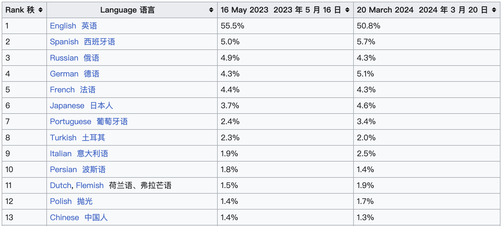
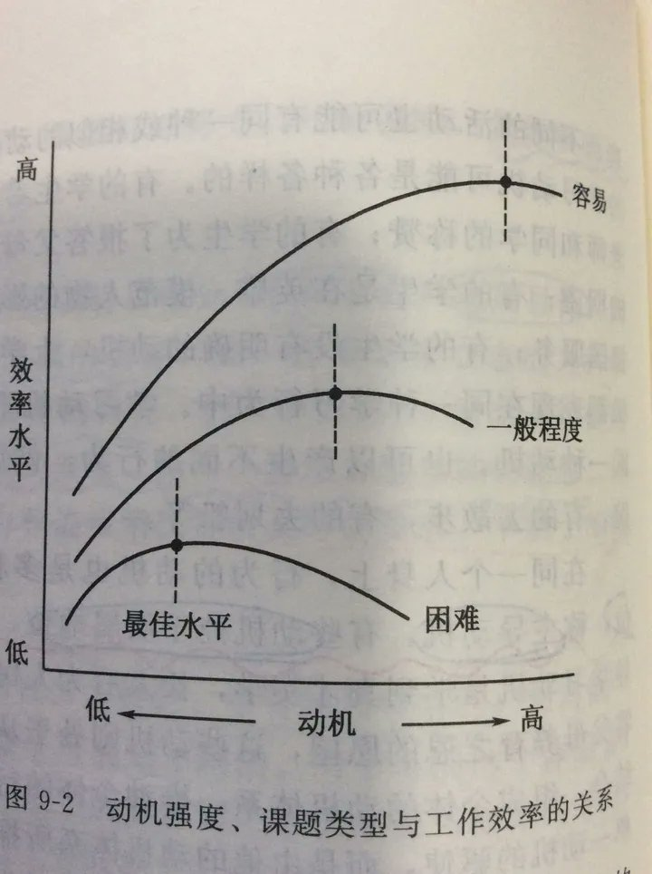

## 全球互联网各种内容语言占比

W3Techs 估计，截至 2024 年 3 月 20 日，万维网上使用各种内容语言的前 1000 万个网站的百分比，我截取了前排名前13的图片：

有兴趣直接访问原文：
https://en.wikipedia.org/wiki/Languages_used_on_the_Internet#cite_note-w3techs_historical_trends-1

从图中可以看见，英语占比在50%。而中文仅仅站1.3%，换句话说，尽量去访问英文网站，英语此时优质内容的来源，占比意味着获取有效内容的可能性更大，所以学习英语很有必要，尤其是我这种处于社会边缘的人士，且访问外网没难度。

这个事实，给我的动机还是不够，已经暂停了1个半月了，我任然在观望，英语拉练的确是停下了，仅仅说动机不够，没错但不仅于此，如果不深入去挖掘，这个现象还会复现，最近经常的刷推特，看到很有意思的信息：

不要过度准备❌，先学会做一个垃圾出来✅，太用力的人走不远，其实是有理论支撑的，叫:

>「耶基斯–多德森定律」

主要概括为以下两点，分别对应图一、图二：

1️⃣ 动机强度与工作效率之间的关系不是线性的，而是呈倒 U 状折线
2️⃣ 不同难度的任务中，也并不是动机越高工作效率就越高

动机过高会导致焦虑、延迟行动等问题，进而影响效率和解决问题的能力，而过低的动机又不足以让人行动起来。实验表明：

1️⃣ 越容易做的事，动机保持较高水平效率最高
2️⃣ 中等难度的事，动机保持在中等水平效率最高
3️⃣ 高难度的事，动机保持在相对低的水平效率最高，因为过高的动机会导致焦虑等负面情绪

 

把这个定律用来分析自己的情况：

半年时间每天朗读15分钟

朗读这件事情的难度于我而言很低，虽然动机其实不高，只是我想获得尊重，做成一件事情，打造某种人设，想确立形象，用来赚钱啥的。这些其实不是很强不是刚需。