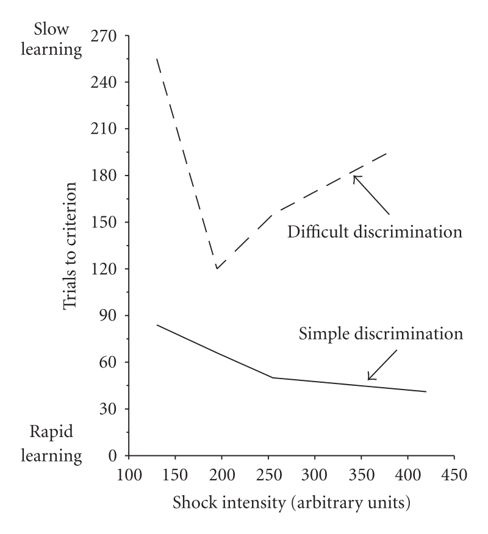

不要过度准备❌，先学会做一个垃圾出来✅，太用力的人走不远，其实是有理论支撑的，叫:

>「耶基斯–多德森定律」

主要概括为以下两点，分别对应图一、图二：

1️⃣ 动机强度与工作效率之间的关系不是线性的，而是呈倒 U 状折线
2️⃣ 不同难度的任务中，也并不是动机越高工作效率就越高

动机过高会导致焦虑、延迟行动等问题，进而影响效率和解决问题的能力，而过低的动机又不足以让人行动起来。实验表明：

1️⃣ 越容易做的事，动机保持较高水平效率最高
2️⃣ 中等难度的事，动机保持在中等水平效率最高
3️⃣ 高难度的事，动机保持在相对低的水平效率最高，因为过高的动机会导致焦虑等负面情绪

 

