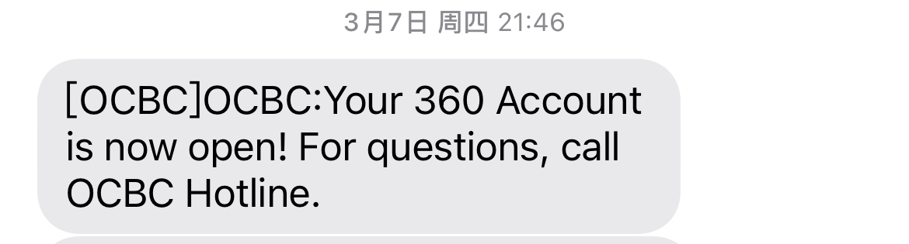
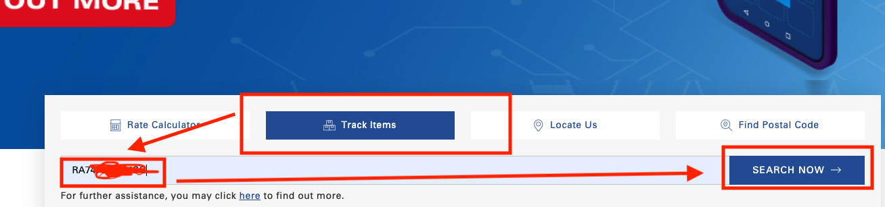
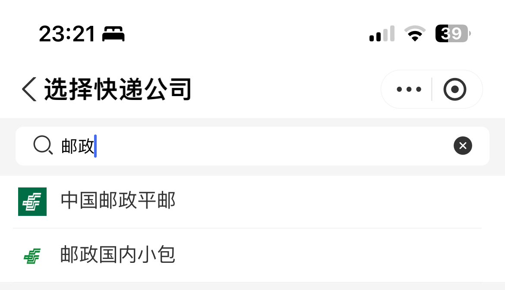
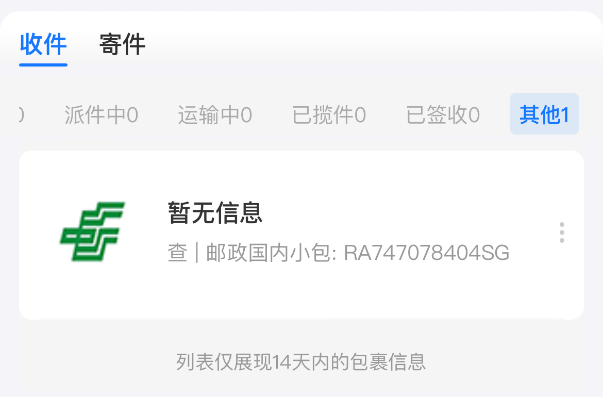

## 如何查询360账户实体卡邮件信息

当你注册完成后，会收到一个短信截图如下：

表明开通成功，接下来就会开始邮寄卡片，此时银行是不会主动告诉你快递单号的，这时候，就需要自己发邮件问。
>必须使用使用英文发邮件，
我的是
I want to check the courier number of the mail, so that I can check the courier information in time to avoid missing the courier

如上图所示我是7日开通，先后我发了2次邮件咨询快递单号，如下图：

最终在13日收到单号，也就是说一个星期之内就会得到快递单号。

接下来就是去[戳此进入新加坡邮政官网](https://www.singpost.com/)查询。

> 网址：https://www.singpost.com/

进入后一般是英文，点击「Track Items」后在下面的搜索框中输快递单号，然后点击「SEARCH NOW」如图：

查询的到信息是这样的：

看到红色部分就是说明已经到了国内。这时候，需要在支付宝上查询快递信息了，单号不会变。

进入到支付宝搜索小程序「我的快递」，进入小程序后，复制的单号点击查询，进入新的页面这时候，要选择快递公司了。输入邮政会出现的2个选项如下图：

不要选第一个，查询不到。一开始我也是选第一个，就是查不到然后我在列表看到了邮政有个公司叫「邮政国内小包」我突然觉得长见识了，不愧是国企，小包邮件，居然不是同一家的活。。。

回到正题，选「小包」就能查询到了。为了方便建议把这个小程序添加到首页，方便随时查看。这是3月15日的操作。一切看似乎在有序的进行。。。

## 周末不派件
到了16日周六我再次去支付宝看邮件信息的时候，我懵了。。是有一个邮政的快递件，但是显示暂无信息！！！？？？

我想难道是邮政周末休息？我立马去「新加坡邮政官网」邮政信息还是一样

没变，我想换个渠道去查，这时候就去微信了，
按照下图方式就查到了信息：

结果是也没有更新，进度停留在15日。很可能就是周末会休息，于是我再去去搜了下，

>网友说邮政周末不休，但是营业时间缩短，而且人很少，也不派件。。。

结论出来了，周末不派件，按照当前的进度，下周就能收到了。